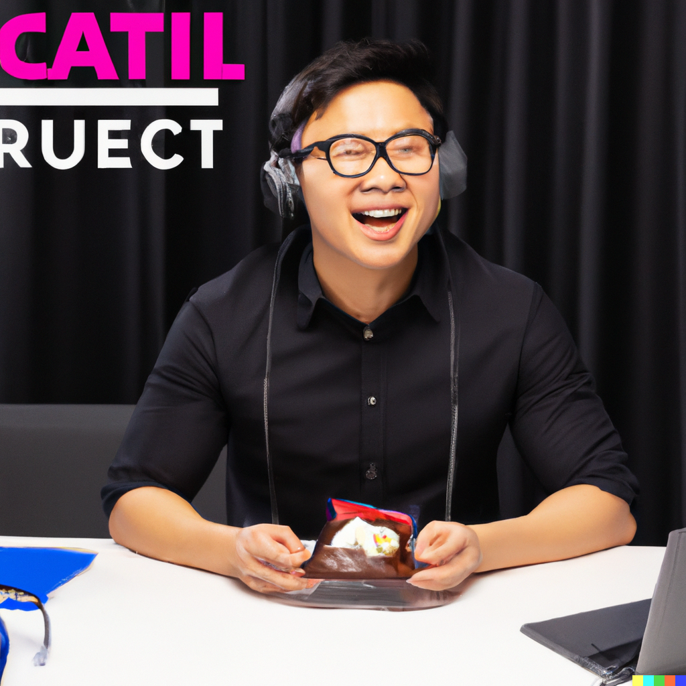

# Persona: Jordan Nguyen (Mobile App User)

**Background:**
Jordan Nguyen is a 28-year-old aspiring speaker and tech enthusiast. With a background in artificial intelligence research, Jordan is keen on sharing cutting-edge insights with a broader audience and establishing a presence in the speaking circuit.

**Demographics:**
- **Age:** 28
- **Gender:** Non-binary
- **Interests:** Artificial intelligence, machine learning, public speaking
- **Location:** Seattle, WA

**Goals:**
1. Establish a presence as a speaker in the tech industry.
2. Improve public speaking skills and engage with diverse audiences.
3. Leverage technology to enhance the impact of presentations.
4. Connect with mentors and fellow speakers for guidance and collaboration.

**Needs:**
1. A platform to create and manage a professional speaker profile.
2. AI-powered tools for brainstorming presentation ideas and titles.
3. Guidance on structuring presentations for maximum impact.
4. Access to a community where Jordan can connect with experienced speakers.

**Challenges:**
1. Building a reputation as a speaker in a competitive field.
2. Balancing technical depth with audience-friendly content.
3. Finding opportunities to collaborate with established speakers.
4. Navigating the complexities of creating engaging presentations.

**Preferred Platform Features:**
- AI-powered idea generation and presentation structuring tools.
- User-friendly community features for networking with speakers.
- Resources and guides on effective public speaking in the tech industry.

**How SpeakerToolkit.net Helps:**
SpeakerToolkit.net provides Jordan with the tools needed to kickstart a speaking career. The AI-powered features assist in brainstorming ideas and structuring presentations, while the community aspect connects Jordan with mentors and peers. The platform acts as a valuable resource in Jordan's journey to becoming a recognized speaker in the tech industry.

**Quote:**
"SpeakerToolkit.net is my go-to platform for navigating the world of public speaking in tech. The AI tools help me shape my ideas, and the community provides invaluable insights. It's a must-have for anyone looking to make an impact in the speaking circuit."
