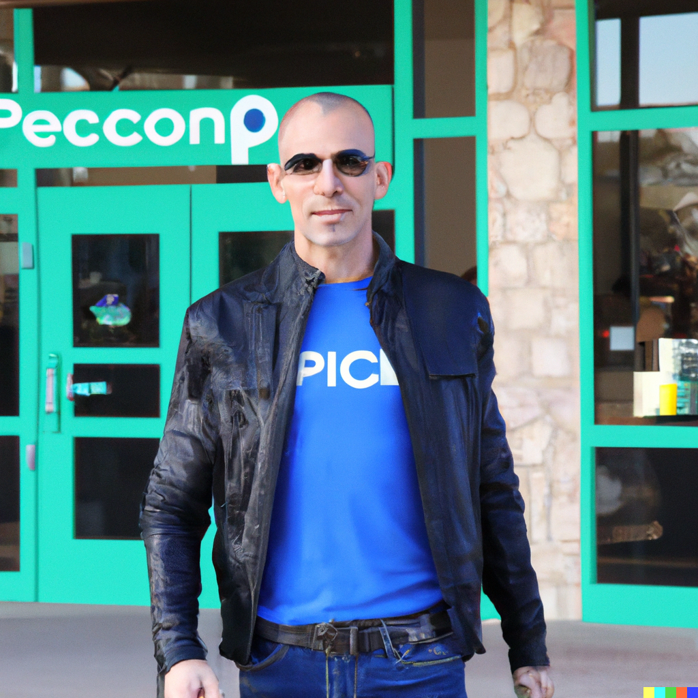

# Persona: Mark Rodriguez (Event Organizer)

**Background:**
Mark Rodriguez, 45, is a seasoned technical speaker and software engineer based in Seattle, WA. With over two decades of experience in the tech industry, Mark is known for his expertise in cloud computing and is passionate about sharing his knowledge with diverse audiences.

**Demographics:**
- Age: 45
- Gender: Male
- Location: Seattle, WA
- Interests: Cloud computing, open-source projects, mountain biking, and mentoring aspiring developers.

**Goals:**
Mark's primary goal is to share his knowledge and insights on cloud computing through speaking engagements. He aims to contribute to the tech community by providing valuable and accessible information to both seasoned professionals and newcomers.

**Needs:**
- Speaker Profile Management: Mark needs a platform to manage and showcase his speaker profile, including details about his background, expertise, and past speaking engagements.
- Efficient Event Management: Tools for managing speaking engagements, including event details, schedules, and communication with event organizers, are crucial for Mark's workflow.

**Challenges:**
- Managing Diverse Topics: Mark often speaks on diverse topics within cloud computing, requiring a platform that can efficiently organize and present information on various subjects.
- Time Management: Balancing speaking engagements, work commitments, and personal interests poses a challenge for Mark.

**Preferred Platform Features:**
1. **Detailed Speaker Profiles:** A feature that allows Mark to create and update his detailed speaker profile.
2. **Event Management Tools:** Efficient tools for managing speaking engagements, including event details, schedules, and communication with organizers.
3. **Topic Tagging:** A system for tagging and organizing presentations based on different cloud computing topics.

**How SpeakerToolkit.net Helps:**
- **Detailed Speaker Profiles:** SpeakerToolkit.net provides Mark with a platform to create and maintain a detailed speaker profile, ensuring accurate representation and visibility.
- **Event Management Tools:** The platform's event management tools streamline Mark's workflow, making it easier to organize and coordinate speaking engagements efficiently.
- **Topic Tagging:** SpeakerToolkit.net's topic tagging system allows Mark to categorize and organize his presentations, making it simple for event organizers to find relevant content.

**Quote:**
*"SpeakerToolkit.net has become an integral part of my journey as a technical speaker. It not only simplifies the logistics of managing speaking engagements but also enhances my visibility within the tech community. A valuable tool for any speaker looking to make an impact."* - Mark Rodriguez